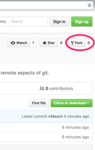
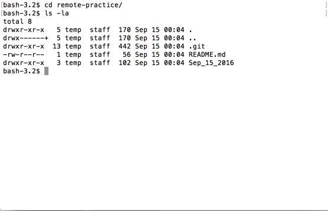
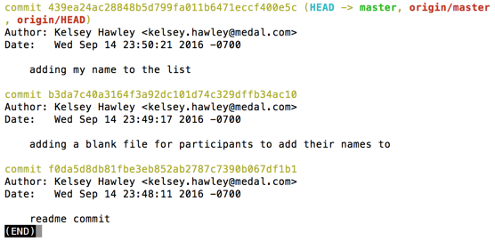

# git clone

## Forking at Home

If you are part of a live workshop, please skip this part and move on to [cloning](#cloning).  For this workshop, we have added your names to the list of contributors for this repo, granting you push permissions.  This will allow you to experience the joys (and pains) of multiple collaborators working on a repo simultaneously.

If you are at home, please follow the examples below to first _fork_ the repository.  Forking will create a remote copy in _your_ GitHub account and give you access to push to that repository.

Make sure you are signed in, then click the _Fork_ button on the repo:



This will cause the original repo to be _cloned_ into your GitHub account.  You should a page like this:


Notice that the repo has your github username and then the name of the repo, with a line below stating that it was originally forked from a different owner's repo.

Now you can continue onto the cloning section.  Just be sure to use your forked version when grabbing the cloning url.

## Cloning {#cloning}

On that page, click the big green "Clone or Download button" and then copy the link.


You may notice there are other options than "Clone with HTTPS".  Ignore those for now.  The https url is the easiest to get started using.

`git clone <remote_url> <folder_to_clone_into>` is the command to copy a remote repository (at `<remote_url>`) to your local computer.  It will copy or 'clone' the contents into the specified folder.

First `cd` onto your Desktop, then `git clone` the link.

```
cd ~/Desktop
git clone https://github.com/khawley/git-tutorial-remote-demo-repo.git remote-practice
```


Now if you `cd` into that directory, you'll probably see a `README.md` and a folder there.

```
cd remote-practice
ls -la
```



You can also do a `git remote` to see we have something called `origin` there now.

```
$ git remote
```


`origin` is the default remote name in a repo, just like `master` is the default branch name in a repo.

`git remote -v` will show us the _verbose_ name of our remote repo.

```
$ git remote -v
```


You should see that the link we copied earlier to clone the repo is the same as the url listed with our `git remote -v` command.

If we do a git log, you'll see a new pointer next to the commits too.



`origin/master` and `origin/HEAD` now appear as pointers.  This will be useful as you learn to push and pull, to be aware of what is still a _local only_ commit and what exists on both.
